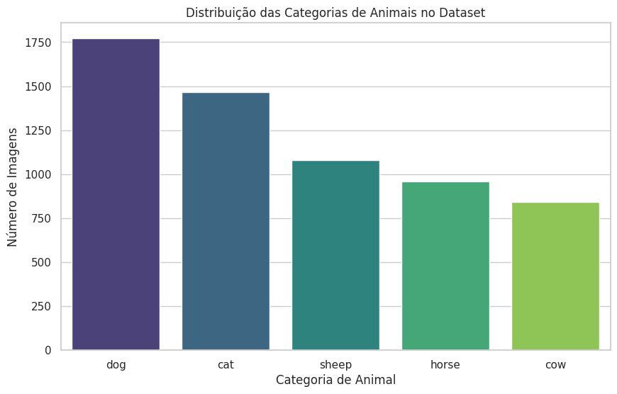
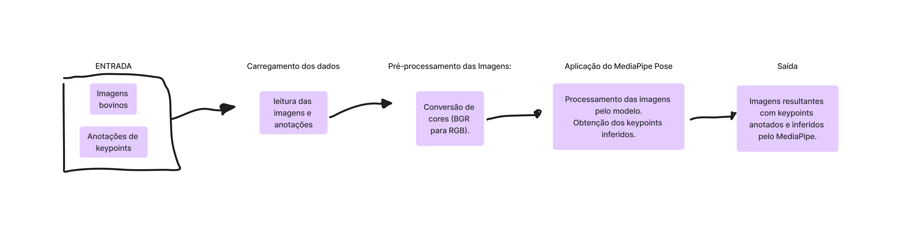
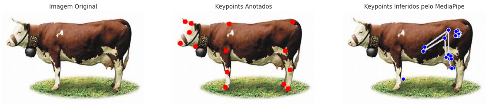

# **Animal Pose Estimation - Dataset de Bovinos**

## **1. Análise Exploratória do Dataset**

### **Descrição do Dataset**
O **ANIMAL-POSE DATASET** é um conjunto de dados que contém imagens de diferentes categorias de animais, cada uma anotada com keypoints que indicam partes específicas do corpo. O dataset inclui as seguintes categorias de animais:
- **Dog** (Cão)
- **Cat** (Gato)
- **Sheep** (Ovelha)
- **Horse** (Cavalo)
- **Cow** (Bovino)

### **Distribuição das Categorias de Animais no Dataset**
A análise exploratória inicial revelou a distribuição das categorias no dataset conforme ilustrado no gráfico abaixo:



- **Interpretação:** O gráfico mostra que a categoria com o maior número de imagens é a dos cães, seguida por gatos. A categoria de bovinos, que é o foco deste trabalho, possui o menor número de imagens em comparação com as outras categorias.

### **Média de Keypoints por Categoria de Animal**
A média de keypoints anotados por categoria de animal está uniformemente distribuída, indicando que cada imagem possui aproximadamente 20 keypoints anotados:


- **Interpretação:** Todas as categorias possuem uma média de 20 keypoints por imagem, o que sugere uma consistência na anotação de keypoints para cada tipo de animal.

### **Número de Imagens de Bovinos**
- O número total de imagens de bovinos disponíveis no dataset é de **745**. Esse conjunto será utilizado para as próximas etapas do processamento.

## **2. Processamento de Imagens de Bovinos**

### **Filtragem do Dataset**
Para focar na categoria de interesse, realizamos uma filtragem do dataset para incluir apenas as imagens de bovinos. O processo consistiu nas seguintes etapas:

1. **Carregamento do Dataset Completo:** Todas as imagens e anotações foram carregadas a partir do arquivo JSON fornecido.
2. **Identificação das Imagens de Bovinos:** As imagens foram filtradas para selecionar apenas aquelas pertencentes à categoria 'cow'.
3. **Verificação de Disponibilidade das Imagens:** As imagens identificadas foram verificadas quanto à sua presença no diretório de imagens.

### **Figura Ilustrativa do Processo**
A figura abaixo representa o processo de filtragem e pré-processamento das imagens de bovinos, desde o carregamento das imagens e anotações até a preparação para a estimativa de pose:



### **Exemplo Detalhado Passo-a-Passo**
**Passo 1:** Carregar as anotações do arquivo `keypoints.json` e as imagens correspondentes do diretório.
```python
# Carregar as anotações do arquivo JSON
with open('path_to_annotations/keypoints.json', 'r') as f:
    annotations = json.load(f)

# Converter anotações para um DataFrame
keypoints_df = pd.DataFrame(annotations['annotations'])
```

**Passo 2:** Filtrar as imagens de bovinos com base na categoria identificada e verificar sua presença no diretório de imagens.
```python
# Filtrar apenas as imagens de bovinos
bovine_keypoints = keypoints_df[keypoints_df['category_id'] == 5]
# Verificar se as imagens estão disponíveis
bovine_keypoints = bovine_keypoints[bovine_keypoints['image_name'].isin(available_images)]
```

**Passo 3:** Aplicar o pré-processamento nas imagens, como redimensionamento e conversão de cores.
```python
# Converter BGR para RGB
image_rgb = cv2.cvtColor(image, cv2.COLOR_BGR2RGB)
```

**Passo 4:** Executar o MediaPipe Pose para detectar os keypoints inferidos.
```python
# Executar MediaPipe Pose
results = run_mediapipe_pose(image)
```

**Passo 5:** Comparar os keypoints anotados com os keypoints inferidos.
```python
# Desenhar keypoints anotados e inferidos
plt.scatter(annotated_keypoints[:, 0], annotated_keypoints[:, 1], c='blue', label='Keypoints Anotados', s=50)
plt.scatter(mediapipe_keypoints[:, 0], mediapipe_keypoints[:, 1], c='red', label='Keypoints MediaPipe', s=50)
```

## **3. Resultados Finais do Processamento**

### **Comparação Visual dos Keypoints**
A comparação visual das etapas de processamento foi realizada para algumas imagens de bovinos, como mostrado na figura abaixo:




- **Interpretação:** A imagem à esquerda mostra a imagem original do bovino, a imagem do meio exibe os keypoints anotados manualmente, e a imagem à direita apresenta os keypoints inferidos pelo MediaPipe. Apesar de o MediaPipe não ser treinado para detectar keypoints em animais, foi possível visualizar algumas detecções em locais aleatórios.

### **Resumo dos Resultados Obtidos**

1. **Detecção de Keypoints em Bovinos:**
   - O MediaPipe não foi capaz de detectar keypoints específicos de bovinos de maneira precisa. Os keypoints detectados estão frequentemente desalinhados com a anatomia do animal.
   
2. **Visualização dos Keypoints Anotados vs. MediaPipe:**
   - Os keypoints anotados manualmente apresentam uma localização consistente com a estrutura corporal do bovino, enquanto os keypoints inferidos pelo MediaPipe não correspondem adequadamente a essas posições.

3. **Comparação das Coordenadas dos Keypoints:**
   - A comparação dos keypoints inferidos com os anotados sugere uma discrepância significativa entre as posições dos pontos, indicando que o modelo não é adequado para este tipo de tarefa.

## **4. Conclusões**

### **Principais Aprendizados**
- **Entendimento das Limitações de Modelos Pré-Treinados:** O MediaPipe, treinado para detectar poses humanas, não generaliza bem para animais, como bovinos.
- **Importância de Modelos Específicos:** Para estimativa de pose em animais, é necessário utilizar modelos treinados com dados apropriados para esse contexto.
- **Processamento de Dados Complexos:** A experiência proporcionou um aprendizado valioso na manipulação de datasets complexos e na execução de tarefas de visão computacional em contextos não convencionais.

### **Limitações do Trabalho**
- **Modelo Inadequado:** O MediaPipe não foi projetado para estimativa de pose em animais, resultando em detecções imprecisas.
- **Quantidade de Imagens de Bovinos:** A categoria de bovinos possui um número menor de imagens, o que limita a quantidade de dados disponíveis para análise.


### **Sugestões de Trabalhos Futuros**
- **Utilizar Modelos Treinados Especificamente para Animais:** Modelos como DeepLabCut ou OpenPose adaptado para animais poderiam proporcionar melhores resultados.
- **Aumentar o Dataset:** A coleta de mais imagens de bovinos, com mais variações de pose e ambiente, ajudaria a melhorar a análise.
